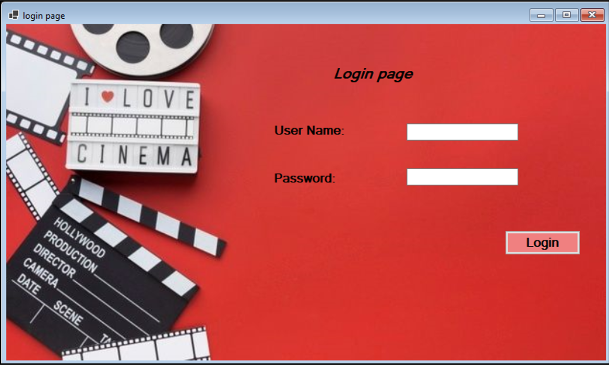
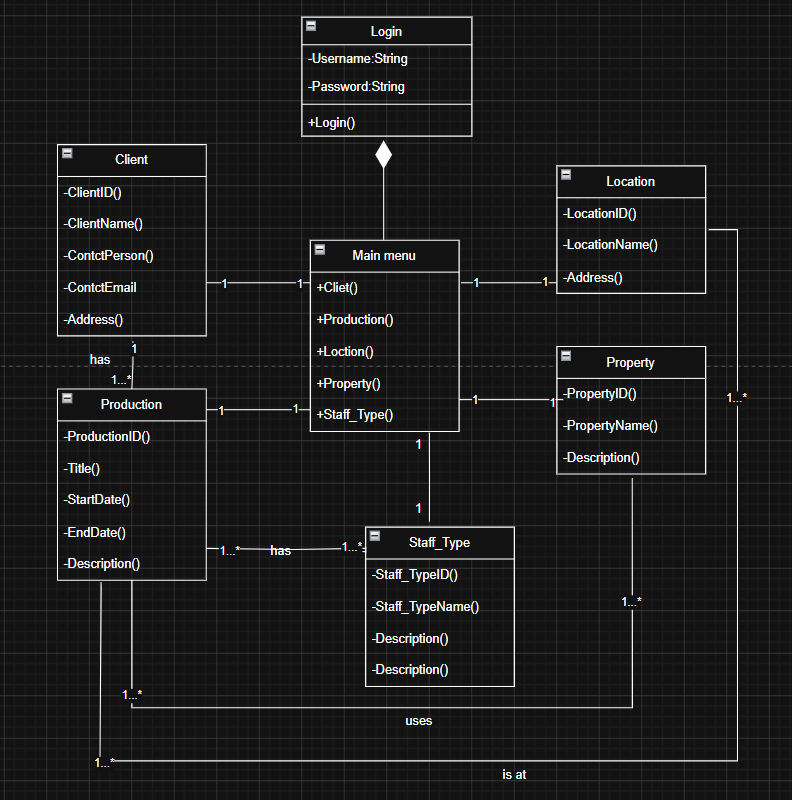
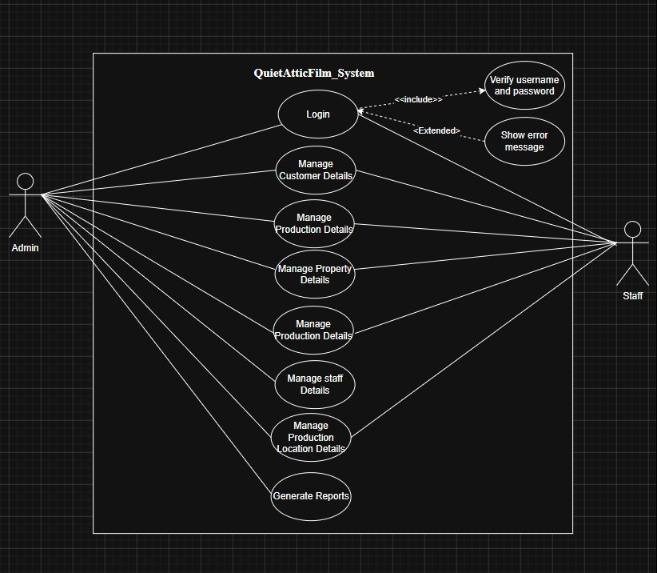

<h1 align="center">
  <br/>
  🎬 QuietAtticFilms Database System
  <br/>
</h1>

<h4 align="center">A Relational Database Management System for Film Production Management.</h4>

<p align="center"><em>Organizing Film Operations Through Structured Data.</em></p>


<p align="center">
  
</p>


<p align="center">
  
  
  
</p>


---

## 🚀 Overview

**QuietAtticFilms Database System** is a relational database project developed to manage film production-related information efficiently.

The system stores and manages data related to films, properties, locations, staff members, and security personnel using structured SQL database design.

This project demonstrates database design concepts including:

- Entity Relationship Design
- Table Relationships
- Primary Keys
- Foreign Keys
- Data Normalization
- SQL Queries


---

## 🖥️ Database Design Preview


### 📌 Class Diagram


<p align="center">



</p>


### 📌 Use Case Diagram


<p align="center">



</p>


---

## ✨ Features


### 🎬 Film Management

- Store film production details
- Manage film-related records
- Maintain production information


### 👥 Staff Management

- Store staff details
- Manage employee information
- Track assigned roles


### 📍 Location Management

- Store filming locations
- Manage location information
- Maintain location records


### 🏠 Property Management

- Manage properties used in productions
- Store property details
- Track available resources


### 🔐 Security Personnel Management

- Store security information
- Manage assigned security records


---

## 🛠️ Database Technology


| Layer | Technology |
|---|---|
| Database Language | SQL |
| Database Type | Relational Database |
| Design Concept | Normalization |
| Data Storage | Tables |
| Relationship | Primary Key / Foreign Key |


---

## ⚡ Getting Started


### Prerequisites

- MySQL / SQL Server / Oracle Database
- SQL Management Tool


---

## 📥 Installation


### 1. Clone Repository


```bash
git clone https://github.com/your-username/QuietAtticFilms-Database.git
```


### 2. Open Database Tool


Open your SQL management software.


### 3. Create Database


Run:


```sql
QuietAtticFilmsCREATE.sql
```


### 4. Insert Data


Execute:


```sql
QuietAtticFilmsUSE.sql
```

Then run the remaining SQL files:

```
QuietAtticFilmsCLIENT.sql

QuietAtticFilmsLOC.sql

QuietAtticFilmsPRO_.sql

QuietAtticFilmsPROPERTY.sql

QuietAtticFilmsSecper.sql

QuietAtticFilmsSTAFF.sql
```


---

## 📂 Project Structure


```
QuietAtticFilms-Database/

│
├── SQL/
│
│   ├── QuietAtticFilmsCREATE.sql
│   ├── QuietAtticFilmsUSE.sql
│   ├── QuietAtticFilmsCLIENT.sql
│   ├── QuietAtticFilmsLOC.sql
│   ├── QuietAtticFilmsPRO_.sql
│   ├── QuietAtticFilmsPROPERTY.sql
│   ├── QuietAtticFilmsSecper.sql
│   └── QuietAtticFilmsSTAFF.sql
│
│
├── images/
│
│   ├── quietattic-banner.png
│   ├── class-diagram.png
│   └── usecase-diagram.png
│
│
└── README.md

```


---

## 🎯 Project Objectives


- Design a structured relational database
- Reduce data redundancy
- Maintain accurate relationships between entities
- Apply SQL database concepts
- Manage film production information efficiently


---

## 📄 License


This project is developed for educational purposes.


---

<p align="center">

Built with ❤️ using SQL by <a href="https://github.com/IleeshaUdari"><strong>M.G.Ileesha Udari Sasmitha</strong></a>

</p>
